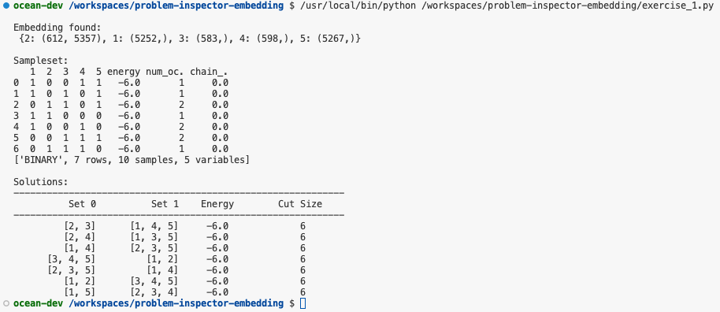
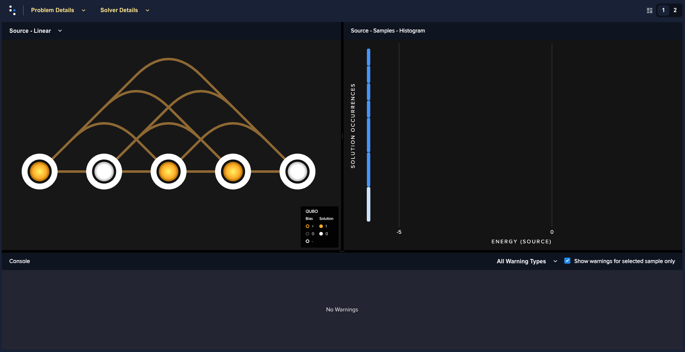
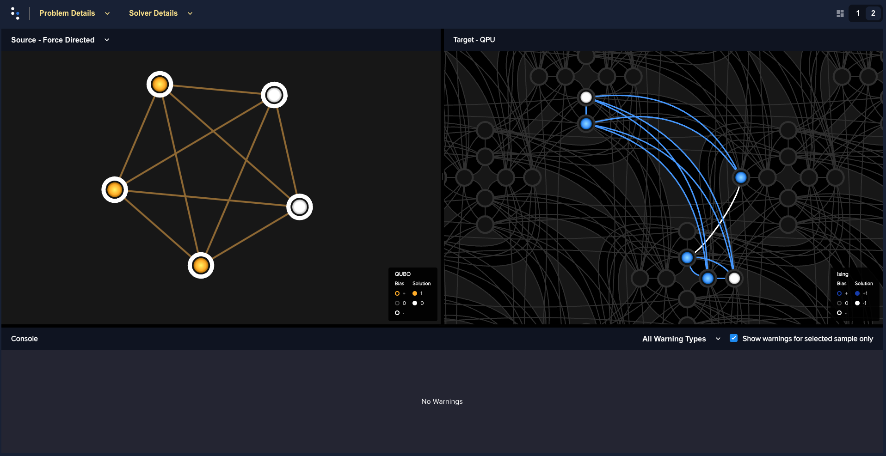
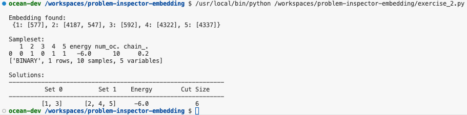
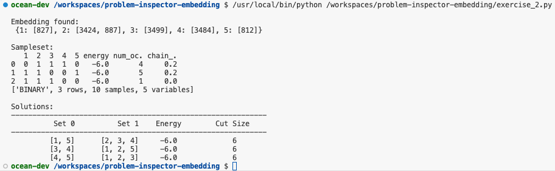
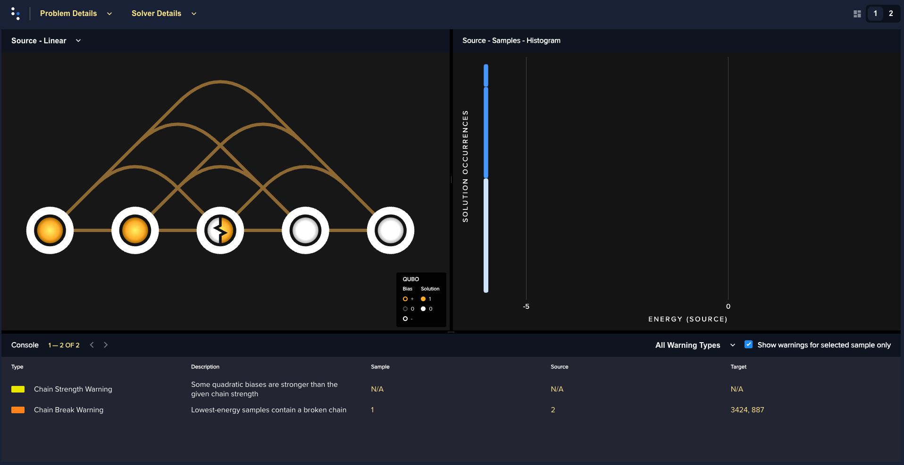
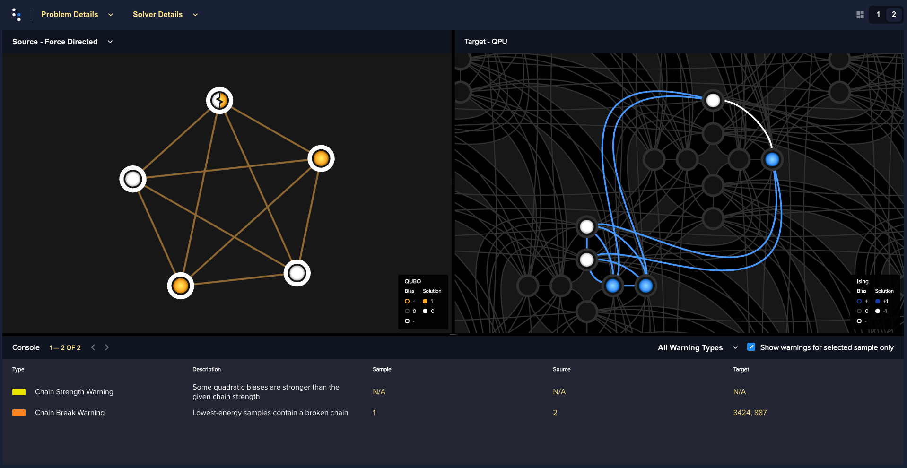

# Explore Embeddings with the Problem Inspector

Explore different embedding methods and chain strength using the Problem Inspector.

## Exercise 1

Run the first program, `exercise_1.py`. Examine the sampleset that is printed to the command-line.

The output is as follows:

Now, add in the problem inspector with the following steps.

 1. Import the package that contains the problem inspector.
 2. Add the command to open the problem inspector after the QUBO has been sampled.

The program will open the problem inspector.

## Exercise 2

Run the second program, `exercise_2.py`. Examine the embedding and sampleset that are printed to the command-line.

The output is as follows:

Now, add in the problem inspector with the following steps.

 1. Import the package that contains the problem inspector.
 2. Add the command to open the problem inspector after the QUBO has been sampled.

The program will open the problem inspector.

## License

Released under the Apache License 2.0. See [LICENSE](LICENSE) file.
